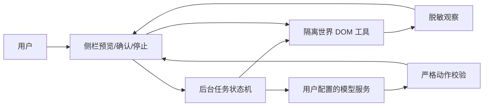

# 浏览器助手设计

输入合同：requirements.md；用户授权最佳实践自主实施。这里定义实现方案，不声称用户逐条确认过本文。

## 边界与数据流

独立侧栏 ES module UI → extension-only runtime 消息 → assistant 服务 → 模型客户端 / tabs+scripting 页面适配器。

页面内容为不可信数据。模型只输出 JSON `{tool,args,reason}`，不能给 CSS selector/JS；DOM 元素引用由观察器生成并保存于隔离世界，包含快照 ID。MutationObserver 标记快照过期；动作验证文档、URL、元素连接状态、类型、可见性、禁用状态。写操作确认绑定动作与快照，不允许确认后替换目标。

## 工具合同

| 工具 | 参数 | 策略 |
| --- | --- | --- |
| observe | 无 | 读取当前固定标签页，新页面发送前需预览批准 |
| click | snapshotId, elementId | 辅助模式且逐次确认；不允许密码/敏感字段、文件、下载链接 |
| fill | snapshotId, elementId, value | 辅助模式且逐次确认；仅普通可写输入，禁止敏感字段 |
| select | snapshotId, elementId, value | 辅助模式且逐次确认；只能选已有值 |
| scroll | direction(up/down), amount(100..1200) | 只读也可；有限滚动 |
| navigate | url | 辅助模式且逐次确认；仅 HTTP(S)，新站点内容发送需新授权 |
| finish | summary | 完成任务，纯文本输出 |

DOM 观察限制正文、元素数与字段长度；不读取 password 或敏感字段的值，不采集隐藏字段。输出 URL 去除 query/fragment/credentials，URL 参数敏感信息不得作为模型导航自动复用。匹配敏感标签及常见凭据模式，持续使用当前配置的实际密钥替换精确匹配。

## 状态和存储

- Session：id, tabId, mode(read/assist), task, status, steps, events, pendingAction, pagePreview, allowedDocument。
- 状态：idle → preview → running → confirmation → running → completed；任意活动状态 → stopped/failed。
- task/页面观察/输入内容/对话仅存在后台内存，UI 打开时可查询；浏览器 storage 不保存原始任务轨迹。
- 关闭侧栏 port：终止任务。后台重启：任务丢失，显示停止而不恢复写入。
- 设置仍兼容原有 apiUrl/actualModel/model/apiKey；storage.local 仅 trusted contexts 访问，内容脚本通过白名单设置消息获得公开配置。
- session secrets 不进入模型消息、公共设置、错误与轨迹。Authorization 只给经用户配置的模型端点；重定向拒绝。

## 接口与校验

`assistant:*` 消息仅接受本扩展 assistant.html，settings 写入仅允许该页面；原 AI 客户端受单独公开合同约束。启动固定当前 tabId，后续切换标签不影响目标；扩展内部页、file/data/javascript 等拒绝。步骤与时长有上限；一次只有一个运行任务；AbortController 取消请求与等待，停止后再次检查状态才允许动作。

错误类别：CONFIG、PAGE_UNAVAILABLE、STALE_SNAPSHOT、INVALID_ACTION、READ_ONLY、TIMEOUT、MODEL_ERROR、STOPPED。错误只暴露脱敏说明，不返回响应原文。限制模型响应与读取页面大小；连接/正文读取均在超时范围内。

## UI 与无障碍

侧栏：状态、目标、任务、模式、页面发送预览、执行/停止、模型配置、动作确认、轨迹、最终答复。CSS token、系统明暗主题、aria-live、可见焦点。所有模型输出用 textContent，不插入 HTML。旧弹窗添加入口，保留既有菜单。

## 限制与后续

首切片覆盖顶层 DOM；跨标签/iframe/视觉/工具箱见完整路线。DOM 点击不是可信物理事件，部分站点可能拒绝；用户可接管。真实模型的稳定性需配置后现场验证；测试服务器只能证明协议与工作流。

## 参考

- https://developer.chrome.com/docs/extensions/reference/api/scripting
- https://developer.chrome.com/docs/extensions/reference/api/sidePanel
- https://developer.chrome.com/docs/extensions/reference/api/storage
