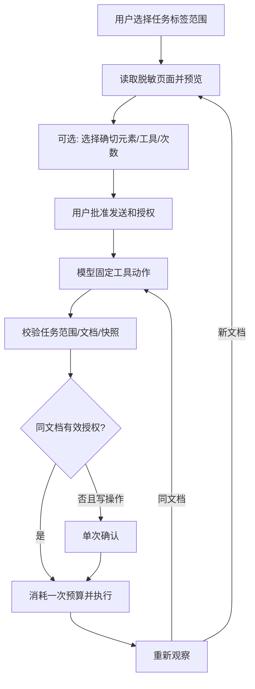

# 范围与自动授权设计

输入：requirements.md，已有用户自主实施授权。扩展固定工具合同，不添加任意代码、CSS selector 或系统命令。

## 模块与合同

- `scope.js`：最多 8 个已选标签的描述、范围断言、元数据投影；初始化只允许同窗口和同普通/无痕环境。
- `grants.js`：用户确认的元素/工具集合，剩余次数 1..8（默认 3），60 秒有效，内存保存，可撤销。
- `browser.js`：Chrome tabs/scripting IO，文档身份、标签描述、创建、关闭与来源验证。
- `runner.js`：状态机与编排，授权判断委托 grants/scope；不处理网页自行提出的权限。
- `scope-ui.js`：选择标签与自动授权控件；`assistant.js` 仅组合 UI 与请求。

新增模型工具：`list_tabs {}`、`switch_tab {tabId:number}`、`open_tab {url}`、`close_tab {tabId:number}`。只读可列出/切换授权页；新开/关闭只在 assist/auto，始终单次确认。切换更改任务目标，不操作窗口焦点。

`assistant:prepare` 可增加 `tabIds:number[]`；省略仍单标签。后台重新读取并校验，绝不信任 UI 传入的 URL/title/incognito。`assistant:preview` 可增加 `automation:{grants:[{elementId,tool}],limit,acknowledged}`，仅 auto 模式接受，非空授权必须 acknowledged 为 true。`assistant:revoke` 清除本次自动授权。

## 文档与元素身份

现有 snapshotId 每次观察更新，只用于单次动作。新增 documentToken 在隔离世界的当前 document 生命周期创建；文档私有 key 绑定 tabId、完整页面 URL 和 documentToken，不传模型。reload、same-URL 新文档及跨标签也能区分。

每个实际 DOM 元素通过 WeakMap 保留 grantId；元素指纹包含类型/label/href/name/id/表单 action、method、target/inline handler/选项。指纹变化会生成新 grantId；替换同名元素也不会继承。普通字段值不入指纹，不观察字段值；fill 后身份可保持。授权按 `{documentKey,tabId,grantId,tool}` 绑定。模型只使用 snapshotId/elementId，不能构造授权。

每次操作前仍检查完整快照 revision、连接、可见性、禁用和敏感字段；自动权限不豁免 DOM 校验。停止或撤销后不再派发新自动动作；已派发动作无法撤销。

## 生命周期

自动授权只在同一批准文档连续有效；进入新页面或切换标签即清除，必须再次选择授权。任务预算 16 步/3 分钟保持。新授权不重置任务上限。

## 多标签执行

- 初始发送预览包含已选标签的脱敏 title/URL，模型只能 list 这组范围；其他浏览器标签不传模型。
- switch 只允许范围内且仍在同窗口/环境的 HTTP(S) 页面；读取后转预览，未批准之前不发新内容。
- open：用户确认 HTTP(S) 地址后在任务窗口创建后台页，加入范围；内容再次预览批准；达到 8 页拒绝。
- close：只能范围内页，至少保留 1 页；提示捕获对应标题、URL 与文档身份。确认前再次验证，页面导航/重载/搬到另一个窗口后拒绝关闭；目标关闭后选择剩余任务页并预览。
- 不关闭任务开始前未选中的页；创建的页不因任务结束自动关闭。
- manifest 设置 incognito split，普通/无痕任务状态分实例；Chrome 本地 storage 配置仍共享，不声称完成 TRUST-13 的持久数据隔离。

## 风险与恢复

标签外请求 SCOPE 错误；页面身份过期 STALE_SNAPSHOT；未知 grant INVALID_GRANT；授权耗尽/过期回逐次确认；标签被关闭或跨环境移动明确失败。DOM click 可有站点业务副作用，即使授权身份稳定也不能证明服务器无写入，UI 必须说明且默认不选任何自动权限。

自动日志只记录工具/目标标签和状态，不记录输入值。页面与模型请求仅内存保存；无真实模型调用必要，使用合成模型验证全部执行路径。

官方接口依据：[Tabs](https://developer.chrome.com/docs/extensions/reference/api/tabs)、[Scripting](https://developer.chrome.com/docs/extensions/reference/api/scripting)。
